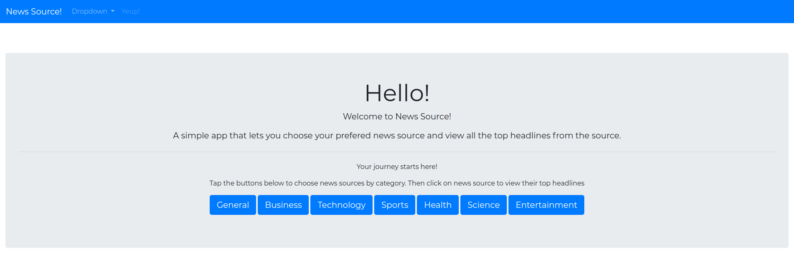

News Source
=======================

**A simple app that lets you choose your preferred news source. View all the top headlines from the source.**

The site welcomes you with a simple styled u.i, with a jumbotron. The buttons display the category of news sources to view from. Just;

- Tap a category to collapse a list of sources. You can tap it again to close the categories sources.
- Choose your preferred news source.
- This will take you to that source's top headlines.
- Browse through the articles and get an description of each article.
- Finally click on the link to read the articles form source.

### What we used
The technoligies used in building this site were  
1. `HTML`
2. `CSS`
3. `Python`
4. `Flask`
5. `Bootstrap 4`
6. `News Api`

Click [here](https://news-source.herokuapp.com/) to see the site.

------------

## Authors

Sam Ngigi

### Acknowledgments

* my mentors David and Latasha
* Patrick, Pascal, Joshua and their work on the google books api.
* This article http://cs.wellesley.edu/~azhou4/cs249/ipython/googlebooks_search.py
------------

License
-------

MIT License

Copyright (c) [2017] [Sam Ngigi]

Permission is hereby granted, free of charge, to any person obtaining a copy
of this software and associated documentation files (the "Software"), to deal
in the Software without restriction, including without limitation the rights
to use, copy, modify, merge, publish, distribute, sublicense, and/or sell
copies of the Software, and to permit persons to whom the Software is
furnished to do so, subject to the following conditions:

The above copyright notice and this permission notice shall be included in all
copies or substantial portions of the Software.

THE SOFTWARE IS PROVIDED "AS IS", WITHOUT WARRANTY OF ANY KIND, EXPRESS OR
IMPLIED, INCLUDING BUT NOT LIMITED TO THE WARRANTIES OF MERCHANTABILITY,
FITNESS FOR A PARTICULAR PURPOSE AND NONINFRINGEMENT. IN NO EVENT SHALL THE
AUTHORS OR COPYRIGHT HOLDERS BE LIABLE FOR ANY CLAIM, DAMAGES OR OTHER
LIABILITY, WHETHER IN AN ACTION OF CONTRACT, TORT OR OTHERWISE, ARISING FROM,
OUT OF OR IN CONNECTION WITH THE SOFTWARE OR THE USE OR OTHER DEALINGS IN THE
SOFTWARE.
